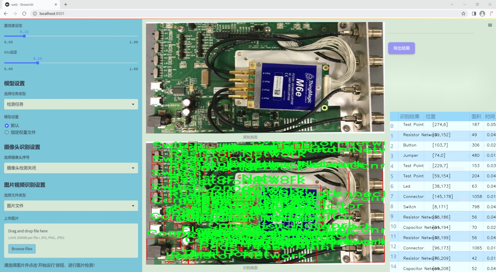
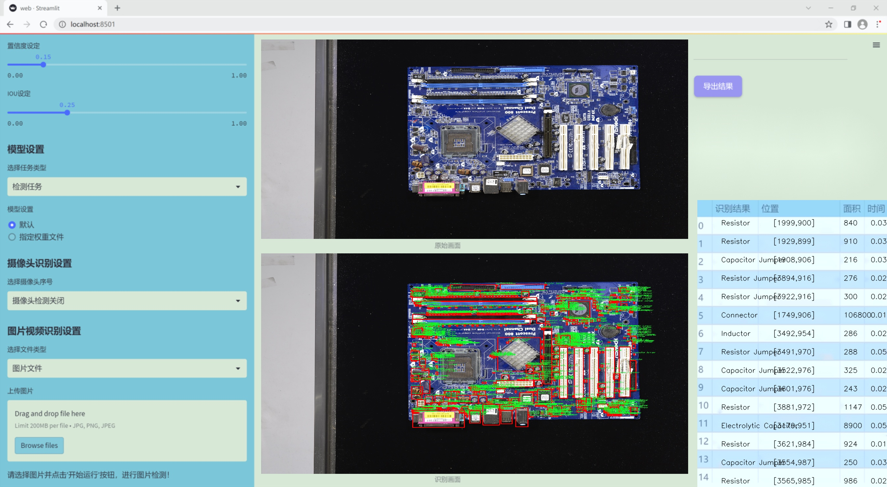
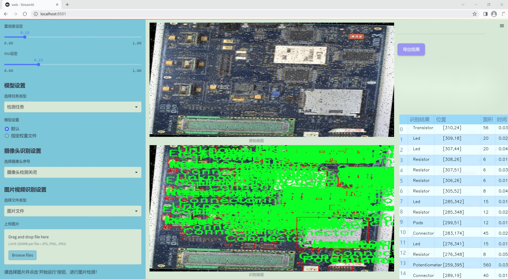
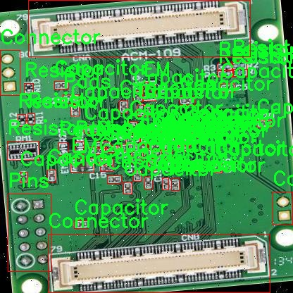
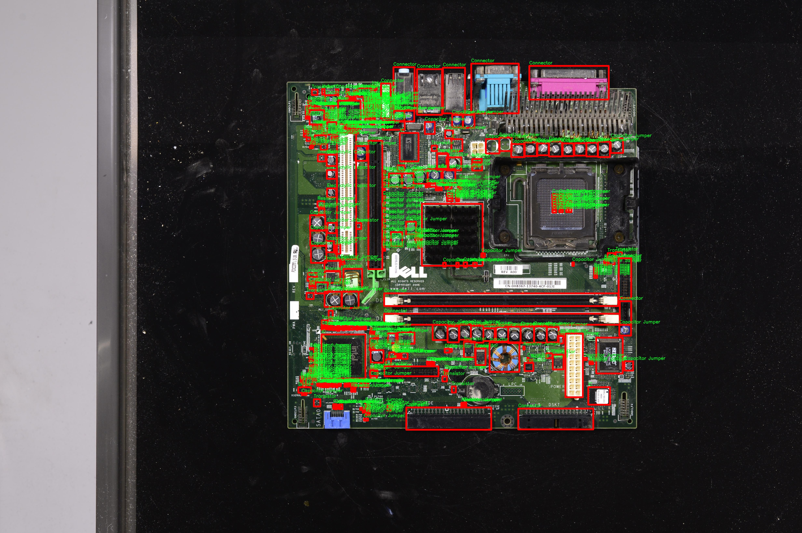
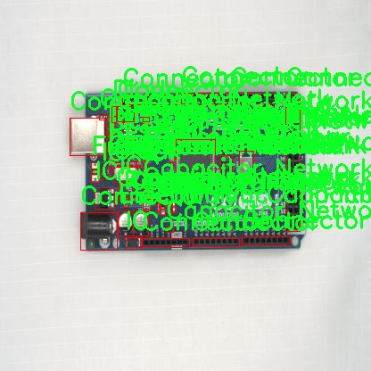
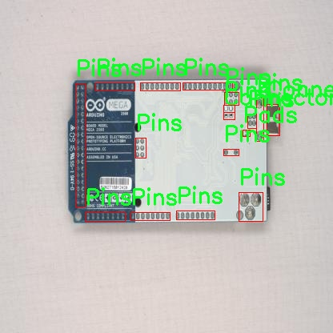
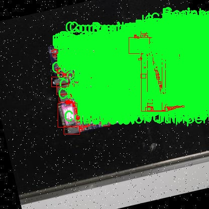

# 改进yolo11-EfficientFormerV2等200+全套创新点大全：电路板元件检测系统源码＆数据集全套

### 1.图片效果展示







##### 项目来源 **[人工智能促进会 2024.10.24](https://kdocs.cn/l/cszuIiCKVNis)**

注意：由于项目一直在更新迭代，上面“1.图片效果展示”和“2.视频效果展示”展示的系统图片或者视频可能为老版本，新版本在老版本的基础上升级如下：（实际效果以升级的新版本为准）

  （1）适配了YOLOV11的“目标检测”模型和“实例分割”模型，通过加载相应的权重（.pt）文件即可自适应加载模型。

  （2）支持“图片识别”、“视频识别”、“摄像头实时识别”三种识别模式。

  （3）支持“图片识别”、“视频识别”、“摄像头实时识别”三种识别结果保存导出，解决手动导出（容易卡顿出现爆内存）存在的问题，识别完自动保存结果并导出到tempDir中。

  （4）支持Web前端系统中的标题、背景图等自定义修改。

  另外本项目提供训练的数据集和训练教程,暂不提供权重文件（best.pt）,需要您按照教程进行训练后实现图片演示和Web前端界面演示的效果。

### 2.视频效果展示

[2.1 视频效果展示](https://www.bilibili.com/video/BV1gCy2YKE3D/)

### 3.背景

研究背景与意义

随着电子技术的迅猛发展，电路板在各类电子设备中的应用愈加广泛。电路板元件的检测与识别在生产、维修及质量控制等环节中扮演着至关重要的角色。传统的人工检测方法不仅效率低下，而且容易受到人为因素的影响，导致检测结果的不准确。因此，开发一种高效、准确的电路板元件检测系统显得尤为重要。

在这一背景下，基于改进YOLOv11的电路板元件检测系统应运而生。YOLO（You Only Look Once）系列模型以其快速的检测速度和较高的准确率在目标检测领域获得了广泛应用。相较于前代模型，YOLOv11在特征提取和目标定位方面进行了多项改进，能够更好地适应复杂背景下的目标检测任务。通过对YOLOv11进行针对电路板元件特性的优化，可以显著提升电路板元件的检测效率和准确性。

本研究所使用的数据集包含772张电路板元件的图像，涵盖了多种类别，如电池、按钮、蜂鸣器、电容器、二极管等。这些类别的多样性为模型的训练提供了丰富的样本，有助于提高模型的泛化能力和识别精度。通过对这些数据的深入分析和处理，能够为改进YOLOv11模型提供必要的基础。

此外，随着工业4.0和智能制造的推进，自动化检测系统的需求日益增加。本研究不仅有助于提升电路板元件的检测效率，还能为智能制造提供技术支持，推动相关领域的进一步发展。因此，基于改进YOLOv11的电路板元件检测系统的研究具有重要的理论价值和实际应用意义。

### 4.数据集信息展示

##### 4.1 本项目数据集详细数据（类别数＆类别名）

nc: 31
names: ['Button', 'Buzzer', 'Capacitor Jumper', 'Capacitor Network', 'Capacitor', 'Clock', 'Connector', 'Diode', 'EM', 'Electrolytic Capacitor', 'Electrolytic capacitor', 'Ferrite Bead', 'Flex Cable', 'Fuse', 'IC', 'Inductor', 'Jumper', 'Led', 'Pads', 'Pins', 'Potentiometer', 'RP', 'Resistor Jumper', 'Resistor Network', 'Resistor', 'Switch', 'Test Point', 'Transducer', 'Transformer', 'Transistor', 'Unknown Unlabeled']


该项目为【目标检测】数据集，请在【训练教程和Web端加载模型教程（第三步）】这一步的时候按照【目标检测】部分的教程来训练

##### 4.2 本项目数据集信息介绍

本项目数据集信息介绍

本项目所使用的数据集名为“circuit elements”，旨在为改进YOLOv11的电路板元件检测系统提供高质量的训练数据。该数据集包含31个类别，涵盖了多种电路板元件，具体类别包括：按钮（Button）、蜂鸣器（Buzzer）、电容跳线（Capacitor Jumper）、电容网络（Capacitor Network）、电容（Capacitor）、时钟（Clock）、连接器（Connector）、二极管（Diode）、EM元件（EM）、电解电容（Electrolytic Capacitor）、电解电容（Electrolytic capacitor）、铁氧体磁珠（Ferrite Bead）、柔性电缆（Flex Cable）、保险丝（Fuse）、集成电路（IC）、电感（Inductor）、跳线（Jumper）、发光二极管（Led）、焊盘（Pads）、引脚（Pins）、可变电阻器（Potentiometer）、RP元件（RP）、电阻跳线（Resistor Jumper）、电阻网络（Resistor Network）、电阻（Resistor）、开关（Switch）、测试点（Test Point）、传感器（Transducer）、变压器（Transformer）、晶体管（Transistor）以及未标记的未知元件（Unknown Unlabeled）。

该数据集的丰富性和多样性使其成为训练电路板元件检测系统的理想选择。通过涵盖不同类型的元件，数据集能够有效地提高模型在实际应用中的识别能力和准确性。此外，数据集中包含的未标记类别为模型的进一步优化提供了潜在的研究方向，允许研究人员探索更复杂的电路板元件识别任务。整体而言，“circuit elements”数据集不仅为YOLOv11的训练提供了坚实的基础，也为电路板元件检测领域的研究与应用开辟了新的可能性。通过对该数据集的深入分析与应用，期望能够推动电路板检测技术的进步，提升自动化检测的效率与准确性。











### 5.全套项目环境部署视频教程（零基础手把手教学）

[5.1 所需软件PyCharm和Anaconda安装教程（第一步）](https://www.bilibili.com/video/BV1BoC1YCEKi/?spm_id_from=333.999.0.0&vd_source=bc9aec86d164b67a7004b996143742dc)


[5.2 安装Python虚拟环境创建和依赖库安装视频教程（第二步）](https://www.bilibili.com/video/BV1ZoC1YCEBw?spm_id_from=333.788.videopod.sections&vd_source=bc9aec86d164b67a7004b996143742dc)

### 6.改进YOLOv11训练教程和Web_UI前端加载模型教程（零基础手把手教学）

[6.1 改进YOLOv11训练教程和Web_UI前端加载模型教程（第三步）](https://www.bilibili.com/video/BV1BoC1YCEhR?spm_id_from=333.788.videopod.sections&vd_source=bc9aec86d164b67a7004b996143742dc)


按照上面的训练视频教程链接加载项目提供的数据集，运行train.py即可开始训练



     Epoch   gpu_mem       box       obj       cls    labels  img_size
     1/200     20.8G   0.01576   0.01955  0.007536        22      1280: 100%|██████████| 849/849 [14:42<00:00,  1.04s/it]
               Class     Images     Labels          P          R     mAP@.5 mAP@.5:.95: 100%|██████████| 213/213 [01:14<00:00,  2.87it/s]
                 all       3395      17314      0.994      0.957      0.0957      0.0843

     Epoch   gpu_mem       box       obj       cls    labels  img_size
     2/200     20.8G   0.01578   0.01923  0.007006        22      1280: 100%|██████████| 849/849 [14:44<00:00,  1.04s/it]
               Class     Images     Labels          P          R     mAP@.5 mAP@.5:.95: 100%|██████████| 213/213 [01:12<00:00,  2.95it/s]
                 all       3395      17314      0.996      0.956      0.0957      0.0845

     Epoch   gpu_mem       box       obj       cls    labels  img_size
     3/200     20.8G   0.01561    0.0191  0.006895        27      1280: 100%|██████████| 849/849 [10:56<00:00,  1.29it/s]
               Class     Images     Labels          P          R     mAP@.5 mAP@.5:.95: 100%|███████   | 187/213 [00:52<00:00,  4.04it/s]
                 all       3395      17314      0.996      0.957      0.0957      0.0845


###### [项目数据集下载链接](https://kdocs.cn/l/cszuIiCKVNis)

### 7.原始YOLOv11算法讲解


###### YOLOv11改进方向

与YOLOv 10相比，YOLOv 11有了巨大的改进，包括但不限于：

  * 增强的模型结构：模型具有改进的模型结构，以获取图像处理并形成预测
  * GPU优化：这是现代ML模型的反映，GPU训练ML模型在速度和准确性上都更好。
  * 速度：YOLOv 11模型现在经过增强和GPU优化以用于训练。通过优化，这些模型比它们的前版本快得多。在速度上达到了25%的延迟减少！
  * 更少的参数：更少的参数允许更快的模型，但v11的准确性不受影响
  * 更具适应性：更多支持的任务YOLOv 11支持多种类型的任务、多种类型的对象和多种类型的图像。

###### YOLOv11功能介绍

Glenn Jocher和他的团队制作了一个令人敬畏的YOLOv 11迭代，并且在图像人工智能的各个方面都提供了YOLO。YOLOv 11有多种型号，包括：

  * 对象检测-在训练时检测图像中的对象
  * 图像分割-超越对象检测，分割出图像中的对象
  * 姿态检测-当用点和线训练时绘制一个人的姿势
  * 定向检测（OBB）：类似于对象检测，但包围盒可以旋转
  * 图像分类-在训练时对图像进行分类

使用Ultralytics Library，这些模型还可以进行优化，以：

  * 跟踪-可以跟踪对象的路径
  * 易于导出-库可以以不同的格式和目的导出
  * 多场景-您可以针对不同的对象和图像训练模型

此外，Ultralytics还推出了YOLOv 11的企业模型，该模型将于10月31日发布。这将与开源的YOLOv
11模型并行，但将拥有更大的专有Ultralytics数据集。YOLOv 11是“建立在过去的成功”的其他版本的之上。

###### YOLOv11模型介绍

YOLOv 11附带了边界框模型（无后缀），实例分割（-seg），姿态估计（-pose），定向边界框（-obb）和分类（-cls）。

这些也有不同的尺寸：纳米（n），小（s），中（m），大（l），超大（x）。


YOLOv11模型

###### YOLOv11与前版本对比

与YOLOv10和YOLOv8相比，YOLOv11在Ultralytics的任何帖子中都没有直接提到。所以我会收集所有的数据来比较它们。感谢Ultralytics：

**检测：**


YOLOv11检测统计


YOLOv10检测统计

其中，Nano的mAPval在v11上为39.5，v10上为38.5；Small为47.0 vs 46.3，Medium为51.5 vs
51.1，Large为53.4 vs 53.2，Extra Large为54.7vs
54.4。现在，这可能看起来像是一种增量增加，但小小数的增加可能会对ML模型产生很大影响。总体而言，YOLOv11以0.3
mAPval的优势追平或击败YOLOv10。

现在，我们必须看看速度。在延迟方面，Nano在v11上为1.55 , v10上为1.84，Small为2.46 v2.49，Medium为4.70
v4.74，Large为6.16 v7.28，Extra Large为11.31
v10.70。延迟越低越好。YOLOv11提供了一个非常低的延迟相比，除了特大做得相当差的前身。

总的来说，Nano模型是令人振奋的，速度更快，性能相当。Extra Large在性能上有很好的提升，但它的延迟非常糟糕。

**分割：**


YOLOV11 分割统计


YOLOV9 分割统计


YOLOV8 分割数据

总体而言，YOLOv 11上的分割模型在大型和超大型模型方面比上一代YOLOv 8和YOLOv 9做得更好。

YOLOv 9 Segmentation没有提供任何关于延迟的统计数据。比较YOLOv 11延迟和YOLOv 8延迟，发现YOLOv 11比YOLOv
8快得多。YOLOv 11将大量GPU集成到他们的模型中，因此期望他们的模型甚至比CPU测试的基准更快！

姿态估计：


YOLOV11姿态估计统计


YOLOV8姿态估计统计

YOLOv 11的mAP 50 -95统计量也逐渐优于先前的YOLOv 8（除大型外）。然而，在速度方面，YOLOv
11姿势可以最大限度地减少延迟。其中一些延迟指标是版本的1/4！通过对这些模型进行GPU训练优化，我可以看到指标比显示的要好得多。

**定向边界框：**


YOLOv11 OBB统计


YOLOv8 OBB统计

OBB统计数据在mAP
50上并不是很好，只有非常小的改进，在某种程度上小于检测中的微小改进。然而，从v8到v11的速度减半，这表明YOLOv11在速度上做了很多努力。

**最后，分类：**


YOLOv 11 CLS统计


YOLOv8 CLS统计

从v8到v11，准确性也有了微小的提高。然而，速度大幅上升，CPU速度更快的型号。


### 8.200+种全套改进YOLOV11创新点原理讲解

#### 8.1 200+种全套改进YOLOV11创新点原理讲解大全

由于篇幅限制，每个创新点的具体原理讲解就不全部展开，具体见下列网址中的改进模块对应项目的技术原理博客网址【Blog】（创新点均为模块化搭建，原理适配YOLOv5~YOLOv11等各种版本）

[改进模块技术原理博客【Blog】网址链接](https://gitee.com/qunmasj/good)


#### 8.2 精选部分改进YOLOV11创新点原理讲解

###### 这里节选部分改进创新点展开原理讲解(完整的改进原理见上图和[改进模块技术原理博客链接](https://gitee.com/qunmasj/good)【如果此小节的图加载失败可以通过CSDN或者Github搜索该博客的标题访问原始博客，原始博客图片显示正常】
### RepViT简介

近年来，与轻量级卷积神经网络(cnn)相比，轻量级视觉变压器(ViTs)在资源受限的移动设备上表现出了更高的性能和更低的延迟。这种改进通常归功于多头自注意模块，它使模型能够学习全局表示。然而，轻量级vit和轻量级cnn之间的架构差异还没有得到充分的研究。在这项研究中，我们重新审视了轻量级cnn的高效设计，并强调了它们在移动设备上的潜力。通过集成轻量级vit的高效架构选择，我们逐步增强了标准轻量级CNN的移动友好性，特别是MobileNetV3。这就产生了一个新的纯轻量级cnn家族，即RepViT。大量的实验表明，RepViT优于现有的轻型vit，并在各种视觉任务中表现出良好的延迟。在ImageNet上，RepViT在iPhone 12上以近1ms的延迟实现了超过80%的top-1精度，据我们所知，这是轻量级模型的第一次。

#### RepViT简介
轻量级模型研究一直是计算机视觉任务中的一个焦点，其目标是在降低计算成本的同时达到优秀的性能。轻量级模型与资源受限的移动设备尤其相关，使得视觉模型的边缘部署成为可能。在过去十年中，研究人员主要关注轻量级卷积神经网络（CNNs）的设计，提出了许多高效的设计原则，包括可分离卷积 、逆瓶颈结构 、通道打乱 和结构重参数化等，产生了 MobileNets ，ShuffleNets和 RepVGG 等代表性模型。

另一方面，视觉 Transformers（ViTs）成为学习视觉表征的另一种高效方案。与 CNNs 相比，ViTs 在各种计算机视觉任务中表现出了更优越的性能。然而，ViT 模型一般尺寸很大，延迟很高，不适合资源受限的移动设备。因此，研究人员开始探索 ViT 的轻量级设计。许多高效的ViTs设计原则被提出，大大提高了移动设备上 ViTs 的计算效率，产生了EfficientFormers ，MobileViTs等代表性模型。这些轻量级 ViTs 在移动设备上展现出了相比 CNNs 的更强的性能和更低的延迟。

轻量级 ViTs 优于轻量级 CNNs 的原因通常归结于多头注意力模块，该模块使模型能够学习全局表征。然而，轻量级 ViTs 和轻量级 CNNs 在块结构、宏观和微观架构设计方面存在值得注意的差异，但这些差异尚未得到充分研究。这自然引出了一个问题：轻量级 ViTs 的架构选择能否提高轻量级 CNN 的性能？在这项工作中，我们结合轻量级 ViTs 的架构选择，重新审视了轻量级 CNNs 的设计。我们的旨在缩小轻量级 CNNs 与轻量级 ViTs 之间的差距，并强调前者与后者相比在移动设备上的应用潜力。


在 ConvNeXt 中，参考该博客提出的基于 ResNet50 架构的基础上通过严谨的理论和实验分析，最终设计出一个非常优异的足以媲美 Swin-Transformer 的纯卷积神经网络架构。同样地，RepViT也是主要通过将轻量级 ViTs 的架构设计逐步整合到标准轻量级 CNN，即MobileNetV3-L，来对其进行针对性地改造（魔改）。在这个过程中，作者们考虑了不同粒度级别的设计元素，并通过一系列步骤达到优化的目标。


详细优化步骤如下：

#### 训练配方的对齐
论文中引入了一种衡量移动设备上延迟的指标，并将训练策略与现有的轻量级 ViTs 对齐。这一步骤主要是为了确保模型训练的一致性，其涉及两个概念，即延迟度量和训练策略的调整。

#### 延迟度量指标
为了更准确地衡量模型在真实移动设备上的性能，作者选择了直接测量模型在设备上的实际延迟，以此作为基准度量。这个度量方法不同于之前的研究，它们主要通过FLOPs或模型大小等指标优化模型的推理速度，这些指标并不总能很好地反映在移动应用中的实际延迟。

#### 训练策略的对齐
这里，将 MobileNetV3-L 的训练策略调整以与其他轻量级 ViTs 模型对齐。这包括使用 AdamW 优化器-ViTs 模型必备的优化器，进行 5 个 epoch 的预热训练，以及使用余弦退火学习率调度进行 300 个 epoch 的训练。尽管这种调整导致了模型准确率的略微下降，但可以保证公平性。

#### 块设计的优化
基于一致的训练设置，作者们探索了最优的块设计。块设计是 CNN 架构中的一个重要组成部分，优化块设计有助于提高网络的性能。

#### 分离 Token 混合器和通道混合器
这块主要是对 MobileNetV3-L 的块结构进行了改进，分离了令牌混合器和通道混合器。原来的 MobileNetV3 块结构包含一个 1x1 扩张卷积，然后是一个深度卷积和一个 1x1 的投影层，然后通过残差连接连接输入和输出。在此基础上，RepViT 将深度卷积提前，使得通道混合器和令牌混合器能够被分开。为了提高性能，还引入了结构重参数化来在训练时为深度滤波器引入多分支拓扑。最终，作者们成功地在 MobileNetV3 块中分离了令牌混合器和通道混合器，并将这种块命名为 RepViT 块。

#### 降低扩张比例并增加宽度
在通道混合器中，原本的扩张比例是 4，这意味着 MLP 块的隐藏维度是输入维度的四倍，消耗了大量的计算资源，对推理时间有很大的影响。为了缓解这个问题，我们可以将扩张比例降低到 2，从而减少了参数冗余和延迟，使得 MobileNetV3-L 的延迟降低到 0.65ms。随后，通过增加网络的宽度，即增加各阶段的通道数量，Top-1 准确率提高到 73.5%，而延迟只增加到 0.89ms！

#### 宏观架构元素的优化
在这一步，本文进一步优化了MobileNetV3-L在移动设备上的性能，主要是从宏观架构元素出发，包括 stem，降采样层，分类器以及整体阶段比例。通过优化这些宏观架构元素，模型的性能可以得到显著提高。

#### 浅层网络使用卷积提取器
ViTs 通常使用一个将输入图像分割成非重叠补丁的 “patchify” 操作作为 stem。然而，这种方法在训练优化性和对训练配方的敏感性上存在问题。因此，作者们采用了早期卷积来代替，这种方法已经被许多轻量级 ViTs 所采纳。对比之下，MobileNetV3-L 使用了一个更复杂的 stem 进行 4x 下采样。这样一来，虽然滤波器的初始数量增加到24，但总的延迟降低到0.86ms，同时 top-1 准确率提高到 73.9%。

#### 更深的下采样层
在 ViTs 中，空间下采样通常通过一个单独的补丁合并层来实现。因此这里我们可以采用一个单独和更深的下采样层，以增加网络深度并减少由于分辨率降低带来的信息损失。具体地，作者们首先使用一个 1x1 卷积来调整通道维度，然后将两个 1x1 卷积的输入和输出通过残差连接，形成一个前馈网络。此外，他们还在前面增加了一个 RepViT 块以进一步加深下采样层，这一步提高了 top-1 准确率到 75.4%，同时延迟为 0.96ms。

#### 更简单的分类器
在轻量级 ViTs 中，分类器通常由一个全局平均池化层后跟一个线性层组成。相比之下，MobileNetV3-L 使用了一个更复杂的分类器。因为现在最后的阶段有更多的通道，所以作者们将它替换为一个简单的分类器，即一个全局平均池化层和一个线性层，这一步将延迟降低到 0.77ms，同时 top-1 准确率为 74.8%。

#### 整体阶段比例
阶段比例代表了不同阶段中块数量的比例，从而表示了计算在各阶段中的分布。论文选择了一个更优的阶段比例 1:1:7:1，然后增加网络深度到 2:2:14:2，从而实现了一个更深的布局。这一步将 top-1 准确率提高到 76.9%，同时延迟为 1.02 ms。

#### 卷积核大小的选择
众所周知，CNNs 的性能和延迟通常受到卷积核大小的影响。例如，为了建模像 MHSA 这样的远距离上下文依赖，ConvNeXt 使用了大卷积核，从而实现了显著的性能提升。然而，大卷积核对于移动设备并不友好，因为它的计算复杂性和内存访问成本。MobileNetV3-L 主要使用 3x3 的卷积，有一部分块中使用 5x5 的卷积。作者们将它们替换为3x3的卷积，这导致延迟降低到 1.00ms，同时保持了76.9%的top-1准确率。

#### SE 层的位置
自注意力模块相对于卷积的一个优点是根据输入调整权重的能力，这被称为数据驱动属性。作为一个通道注意力模块，SE层可以弥补卷积在缺乏数据驱动属性上的限制，从而带来更好的性能。MobileNetV3-L 在某些块中加入了SE层，主要集中在后两个阶段。然而，与分辨率较高的阶段相比，分辨率较低的阶段从SE提供的全局平均池化操作中获得的准确率提升较小。作者们设计了一种策略，在所有阶段以交叉块的方式使用SE层，从而在最小的延迟增量下最大化准确率的提升，这一步将top-1准确率提升到77.4%，同时延迟降低到0.87ms。

注意！【这一点其实百度在很早前就已经做过实验比对得到过这个结论了，SE 层放置在靠近深层的地方效果好】

#### 微观设计的调整
RepViT 通过逐层微观设计来调整轻量级 CNN，这包括选择合适的卷积核大小和优化挤压-激励（Squeeze-and-excitation，简称SE）层的位置。这两种方法都能显著改善模型性能。

#### 网络架构
最终，通过整合上述改进策略，我们便得到了模型RepViT的整体架构，该模型有多个变种，例如RepViT-M1/M2/M3。同样地，不同的变种主要通过每个阶段的通道数和块数来区分。


### 9.系统功能展示

图9.1.系统支持检测结果表格显示

  图9.2.系统支持置信度和IOU阈值手动调节

  图9.3.系统支持自定义加载权重文件best.pt(需要你通过步骤5中训练获得)

  图9.4.系统支持摄像头实时识别

  图9.5.系统支持图片识别

  图9.6.系统支持视频识别

  图9.7.系统支持识别结果文件自动保存

  图9.8.系统支持Excel导出检测结果数据


### 10. YOLOv11核心改进源码讲解

#### 10.1 activation.py

以下是经过简化和注释的核心代码部分：

```python
import torch
import torch.nn as nn

class AGLU(nn.Module):
    """AGLU 激活函数模块，来自 https://github.com/kostas1515/AGLU。"""

    def __init__(self, device=None, dtype=None) -> None:
        """初始化 AGLU 激活函数模块。"""
        super().__init__()
        # 使用 Softplus 激活函数，beta 设置为 -1.0
        self.act = nn.Softplus(beta=-1.0)
        # 初始化 lambda 参数，并将其设为可学习参数
        self.lambd = nn.Parameter(nn.init.uniform_(torch.empty(1, device=device, dtype=dtype)))  
        # 初始化 kappa 参数，并将其设为可学习参数
        self.kappa = nn.Parameter(nn.init.uniform_(torch.empty(1, device=device, dtype=dtype)))  

    def forward(self, x: torch.Tensor) -> torch.Tensor:
        """计算 AGLU 激活函数的前向传播。"""
        # 将 lambda 参数限制在最小值 0.0001 以上
        lam = torch.clamp(self.lambd, min=0.0001)
        # 计算并返回 AGLU 激活函数的输出
        return torch.exp((1 / lam) * self.act((self.kappa * x) - torch.log(lam)))
```

### 代码注释说明：

1. **导入模块**：
   - `torch` 和 `torch.nn` 是 PyTorch 的核心库，用于构建和训练神经网络。

2. **AGLU 类**：
   - 该类继承自 `nn.Module`，表示一个自定义的神经网络模块，主要实现 AGLU 激活函数。

3. **`__init__` 方法**：
   - 初始化 AGLU 激活函数模块。
   - `self.act` 使用 `Softplus` 激活函数，`beta` 参数设置为 -1.0。
   - `self.lambd` 和 `self.kappa` 是可学习的参数，分别初始化为均匀分布的随机值。

4. **`forward` 方法**：
   - 该方法定义了前向传播的计算过程。
   - 使用 `torch.clamp` 将 `lambd` 限制在 0.0001 以上，以避免除以零的情况。
   - 计算 AGLU 激活函数的输出并返回。输出是通过对 `Softplus` 激活函数的结果进行指数运算得到的。

这个文件定义了一个名为 `activation.py` 的模块，主要用于实现一种统一的激活函数，称为 AGLU（Adaptive Gated Linear Unit）。该模块依赖于 PyTorch 库，使用了 PyTorch 的神经网络模块（`torch.nn`）来构建激活函数。

在文件的开头，首先导入了必要的库，包括 `torch` 和 `torch.nn`。接着定义了一个名为 `AGLU` 的类，该类继承自 `nn.Module`，这是 PyTorch 中所有神经网络模块的基类。

在 `AGLU` 类的构造函数 `__init__` 中，初始化了两个参数：`lambd` 和 `kappa`。这两个参数是通过均匀分布初始化的，并且被定义为可学习的参数（`nn.Parameter`），这意味着在训练过程中它们的值会被更新。`lambd` 参数在计算时会被限制在一个最小值（0.0001），以避免出现数值不稳定的情况。激活函数使用了 `nn.Softplus`，其参数 `beta` 被设置为 -1.0，这会影响其形状和输出。

`forward` 方法是该模块的核心，负责计算前向传播。在这个方法中，首先对 `lambd` 参数进行裁剪，确保其不小于 0.0001。然后根据 AGLU 的公式计算输出，具体是通过将输入 `x` 乘以 `kappa`，减去 `lambd` 的对数，再经过 `Softplus` 激活函数处理，最后将结果与 `lambd` 进行指数运算，得到最终的输出。

总的来说，这个模块实现了一种新的激活函数，结合了可学习的参数，使得它在神经网络中的应用更加灵活和有效。

#### 10.2 kacn_conv.py

以下是代码中最核心的部分，并附上详细的中文注释：

```python
import torch
import torch.nn as nn

class KACNConvNDLayer(nn.Module):
    def __init__(self, conv_class, norm_class, input_dim, output_dim, degree, kernel_size,
                 groups=1, padding=0, stride=1, dilation=1,
                 ndim: int = 2, dropout=0.0):
        super(KACNConvNDLayer, self).__init__()
        
        # 初始化参数
        self.inputdim = input_dim  # 输入维度
        self.outdim = output_dim    # 输出维度
        self.degree = degree         # 多项式的阶数
        self.kernel_size = kernel_size  # 卷积核大小
        self.padding = padding       # 填充
        self.stride = stride         # 步幅
        self.dilation = dilation     # 膨胀
        self.groups = groups         # 分组卷积的组数
        self.ndim = ndim             # 数据的维度（1D, 2D, 3D）
        self.dropout = None          # Dropout层初始化为None

        # 如果dropout大于0，则根据维度选择相应的Dropout层
        if dropout > 0:
            if ndim == 1:
                self.dropout = nn.Dropout1d(p=dropout)
            elif ndim == 2:
                self.dropout = nn.Dropout2d(p=dropout)
            elif ndim == 3:
                self.dropout = nn.Dropout3d(p=dropout)

        # 检查分组数和输入输出维度的有效性
        if groups <= 0:
            raise ValueError('groups must be a positive integer')
        if input_dim % groups != 0:
            raise ValueError('input_dim must be divisible by groups')
        if output_dim % groups != 0:
            raise ValueError('output_dim must be divisible by groups')

        # 初始化分组归一化层
        self.layer_norm = nn.ModuleList([norm_class(output_dim // groups) for _ in range(groups)])

        # 初始化多项式卷积层
        self.poly_conv = nn.ModuleList([conv_class((degree + 1) * input_dim // groups,
                                                   output_dim // groups,
                                                   kernel_size,
                                                   stride,
                                                   padding,
                                                   dilation,
                                                   groups=1,
                                                   bias=False) for _ in range(groups)])
        
        # 创建一个缓冲区用于存储范围数组
        arange_buffer_size = (1, 1, -1,) + tuple(1 for _ in range(ndim))
        self.register_buffer("arange", torch.arange(0, degree + 1, 1).view(*arange_buffer_size))
        
        # 使用Kaiming均匀分布初始化卷积层的权重
        for conv_layer in self.poly_conv:
            nn.init.normal_(conv_layer.weight, mean=0.0, std=1 / (input_dim * (degree + 1) * kernel_size ** ndim))

    def forward_kacn(self, x, group_index):
        # 前向传播过程，处理每个分组的输入
        x = torch.tanh(x)  # 应用tanh激活函数
        x = x.acos().unsqueeze(2)  # 计算反余弦并增加维度
        x = (x * self.arange).flatten(1, 2)  # 乘以范围数组并展平
        x = x.cos()  # 计算余弦
        x = self.poly_conv[group_index](x)  # 通过对应的卷积层
        x = self.layer_norm[group_index](x)  # 通过对应的归一化层
        if self.dropout is not None:
            x = self.dropout(x)  # 应用Dropout
        return x

    def forward(self, x):
        # 前向传播，处理整个输入
        split_x = torch.split(x, self.inputdim // self.groups, dim=1)  # 按组分割输入
        output = []
        for group_ind, _x in enumerate(split_x):
            y = self.forward_kacn(_x.clone(), group_ind)  # 对每个分组调用forward_kacn
            output.append(y.clone())  # 保存输出
        y = torch.cat(output, dim=1)  # 将所有分组的输出拼接
        return y
```

### 代码说明：
1. **KACNConvNDLayer**: 这是一个自定义的卷积层类，支持多维卷积（1D, 2D, 3D），并实现了基于多项式的卷积操作。
2. **初始化方法**: 在初始化中，设置了输入输出维度、卷积参数、分组数等，并创建了相应的卷积和归一化层。
3. **前向传播**: `forward_kacn`方法处理每个分组的输入，通过激活函数、卷积和归一化层，最终返回处理后的输出。`forward`方法则处理整个输入，分组后调用`forward_kacn`进行处理，并将结果拼接返回。

这个程序文件定义了一个名为 `kacn_conv.py` 的 PyTorch 模块，主要实现了一种名为 KACN（K-阶激活卷积网络）的卷积层。该模块包含了一个基类 `KACNConvNDLayer` 和三个子类 `KACNConv1DLayer`、`KACNConv2DLayer` 和 `KACNConv3DLayer`，分别用于一维、二维和三维卷积操作。

在 `KACNConvNDLayer` 类的构造函数中，首先初始化了一些卷积层所需的参数，如输入维度、输出维度、卷积核大小、分组数、填充、步幅、扩张等。该类支持多种维度的卷积，通过 `ndim` 参数来指定。根据输入的 `dropout` 参数，选择性地添加 dropout 层以防止过拟合。

构造函数中还进行了参数的有效性检查，例如确保分组数为正整数，并且输入和输出维度能够被分组数整除。接着，创建了一个层归一化的模块列表 `layer_norm`，用于对每个分组的输出进行归一化处理。同时，使用 `conv_class` 创建了一个多项式卷积层的模块列表 `poly_conv`，每个卷积层的输入通道数是 `(degree + 1) * input_dim // groups`，输出通道数是 `output_dim // groups`。

在 `forward_kacn` 方法中，输入首先经过一个激活函数（双曲正切函数），然后进行一系列的数学变换，包括反余弦、乘以一个缓冲区（`arange`），再进行余弦变换，最后通过对应的卷积层和归一化层处理。如果设置了 dropout，则在最后应用 dropout。

`forward` 方法将输入张量 `x` 按照分组进行切分，并对每个分组调用 `forward_kacn` 方法进行处理，最后将所有分组的输出拼接在一起，形成最终的输出。

子类 `KACNConv3DLayer`、`KACNConv2DLayer` 和 `KACNConv1DLayer` 继承自 `KACNConvNDLayer`，并在构造函数中分别指定了相应的卷积和归一化类（`nn.Conv3d`、`nn.Conv2d` 和 `nn.Conv1d`，以及对应的批归一化类）。这些子类的作用是简化创建不同维度卷积层的过程。

整体来看，这个模块提供了一种灵活的方式来构建 KACN 卷积层，适用于多种维度的输入数据，并且包含了多项式卷积的实现，能够在一定程度上增强模型的表达能力。

#### 10.3 val.py

以下是经过简化和注释的核心代码部分，主要集中在YOLO检测验证器的实现上：

```python
import os
import torch
from ultralytics.engine.validator import BaseValidator
from ultralytics.utils.metrics import ConfusionMatrix, DetMetrics, box_iou
from ultralytics.utils.plotting import output_to_target, plot_images

class DetectionValidator(BaseValidator):
    """
    扩展自BaseValidator类的检测验证器，用于基于检测模型的验证。
    """

    def __init__(self, dataloader=None, save_dir=None, pbar=None, args=None, _callbacks=None):
        """初始化检测模型，设置必要的变量和参数。"""
        super().__init__(dataloader, save_dir, pbar, args, _callbacks)
        self.metrics = DetMetrics(save_dir=self.save_dir)  # 初始化检测指标
        self.iouv = torch.linspace(0.5, 0.95, 10)  # mAP@0.5:0.95的IoU向量
        self.niou = self.iouv.numel()  # IoU的数量

    def preprocess(self, batch):
        """对YOLO训练的图像批次进行预处理。"""
        # 将图像转移到设备并归一化
        batch["img"] = batch["img"].to(self.device, non_blocking=True) / 255
        for k in ["batch_idx", "cls", "bboxes"]:
            batch[k] = batch[k].to(self.device)  # 将标签和边界框转移到设备

        return batch

    def postprocess(self, preds):
        """对预测输出应用非极大值抑制（NMS）。"""
        return ops.non_max_suppression(
            preds,
            self.args.conf,
            self.args.iou,
            multi_label=True,
            max_det=self.args.max_det,
        )

    def update_metrics(self, preds, batch):
        """更新检测指标。"""
        for si, pred in enumerate(preds):
            # 处理每个预测结果
            npr = len(pred)  # 当前预测的数量
            pbatch = self._prepare_batch(si, batch)  # 准备当前批次的标签
            cls, bbox = pbatch.pop("cls"), pbatch.pop("bbox")  # 获取当前批次的类别和边界框

            if npr == 0:  # 如果没有预测结果
                continue

            predn = self._prepare_pred(pred, pbatch)  # 准备预测结果
            # 计算正确预测
            stat = self._process_batch(predn, bbox, cls)
            # 更新统计信息
            for k in self.stats.keys():
                self.stats[k].append(stat[k])

    def _process_batch(self, detections, gt_bboxes, gt_cls):
        """
        返回正确预测矩阵。

        Args:
            detections (torch.Tensor): 预测结果，形状为[N, 6]。
            gt_bboxes (torch.Tensor): 真实边界框，形状为[M, 5]。
            gt_cls (torch.Tensor): 真实类别，形状为[M]。

        Returns:
            (torch.Tensor): 正确预测矩阵，形状为[N, 10]。
        """
        iou = box_iou(gt_bboxes, detections[:, :4])  # 计算IoU
        return self.match_predictions(detections[:, 5], gt_cls, iou)  # 匹配预测与真实标签

    def print_results(self):
        """打印每个类别的训练/验证集指标。"""
        pf = "%22s" + "%11i" * 2 + "%11.3g" * len(self.metrics.keys)  # 打印格式
        LOGGER.info(pf % ("all", self.seen, self.nt_per_class.sum(), *self.metrics.mean_results()))  # 打印总体结果

        # 打印每个类别的结果
        if self.args.verbose and self.nc > 1 and len(self.stats):
            for i, c in enumerate(self.metrics.ap_class_index):
                LOGGER.info(pf % (self.names[c], self.seen, self.nt_per_class[c], *self.metrics.class_result(i)))

    def eval_json(self, stats):
        """评估YOLO输出的JSON格式并返回性能统计信息。"""
        if self.args.save_json and len(self.jdict):
            # 评估逻辑...
            pass
        return stats
```

### 代码注释说明：
1. **DetectionValidator类**：这是一个用于YOLO模型验证的类，继承自`BaseValidator`。
2. **__init__方法**：初始化验证器，设置指标、IoU向量等。
3. **preprocess方法**：对输入批次进行预处理，包括将图像归一化和转移到设备。
4. **postprocess方法**：对预测结果应用非极大值抑制，以去除冗余的检测框。
5. **update_metrics方法**：更新当前批次的检测指标，处理每个预测结果并计算正确预测。
6. **_process_batch方法**：计算IoU并返回正确预测的矩阵。
7. **print_results方法**：打印每个类别的检测结果和整体性能指标。
8. **eval_json方法**：评估YOLO模型输出的JSON格式结果并返回性能统计信息。

以上是对核心代码的简化和详细注释，旨在帮助理解YOLO检测验证器的主要功能和流程。

这个程序文件 `val.py` 是一个用于目标检测模型验证的类，继承自 `BaseValidator`。它主要用于处理 YOLO（You Only Look Once）模型的验证过程，包括数据预处理、指标计算、结果输出等功能。

首先，程序导入了一些必要的库和模块，包括操作系统相关的 `os` 和 `Path`，数值计算库 `numpy`，以及深度学习框架 `torch`。此外，还导入了 YOLO 相关的数据处理和验证工具。

`DetectionValidator` 类的构造函数初始化了一些变量和设置，包括数据加载器、保存目录、进度条、参数等。它定义了目标检测的任务，并初始化了一些评估指标，比如 `DetMetrics` 用于计算检测性能，`ConfusionMatrix` 用于混淆矩阵的计算。

在 `preprocess` 方法中，程序对输入的图像批次进行预处理，包括将图像转换为适合模型输入的格式，进行归一化处理，并根据需要保存用于自动标注的信息。

`init_metrics` 方法用于初始化评估指标，判断数据集是否为 COCO 格式，并设置相应的类映射和统计信息。

`get_desc` 方法返回一个格式化的字符串，用于总结 YOLO 模型的类指标。

`postprocess` 方法应用非极大值抑制（NMS）来处理模型的预测输出，以减少重叠的边界框。

`_prepare_batch` 和 `_prepare_pred` 方法分别用于准备验证批次的图像和注释，以及准备模型的预测结果。

`update_metrics` 方法负责更新模型的评估指标，通过比较预测结果和真实标签，计算出正确的预测矩阵，并将结果保存到指定格式的文件中。

`finalize_metrics` 方法设置最终的指标值，包括速度和混淆矩阵。

`get_stats` 方法返回计算得到的指标统计信息，并更新每个类别的目标数量。

`print_results` 方法打印训练或验证集的每个类别的指标，包括图像数量、实例数量和各类指标的平均值。

`_process_batch` 方法计算每个检测的正确预测矩阵，通过计算 IoU（Intersection over Union）来评估预测的准确性。

`build_dataset` 和 `get_dataloader` 方法用于构建 YOLO 数据集和返回数据加载器，方便后续的验证过程。

`plot_val_samples` 和 `plot_predictions` 方法用于绘制验证图像样本和模型预测的边界框，并将结果保存为图像文件。

`save_one_txt` 方法将 YOLO 检测结果保存到文本文件中，采用特定的格式进行存储。

`pred_to_json` 方法将 YOLO 的预测结果序列化为 COCO JSON 格式，以便后续评估。

`eval_json` 方法用于评估 YOLO 输出的 JSON 格式结果，并返回性能统计信息，利用 `pycocotools` 计算 mAP（mean Average Precision）。

整体而言，这个文件实现了 YOLO 模型验证的完整流程，从数据加载、预处理、模型预测到结果评估和输出，提供了一个全面的框架来评估目标检测模型的性能。

#### 10.4 convnextv2.py

以下是代码中最核心的部分，并附上详细的中文注释：

```python
import torch
import torch.nn as nn
import torch.nn.functional as F

class LayerNorm(nn.Module):
    """ 
    自定义的层归一化（Layer Normalization）模块，支持两种数据格式：channels_last（默认）或 channels_first。
    channels_last 对应输入形状为 (batch_size, height, width, channels)，
    而 channels_first 对应输入形状为 (batch_size, channels, height, width)。
    """
    def __init__(self, normalized_shape, eps=1e-6, data_format="channels_last"):
        super().__init__()
        # 权重和偏置参数
        self.weight = nn.Parameter(torch.ones(normalized_shape))
        self.bias = nn.Parameter(torch.zeros(normalized_shape))
        self.eps = eps
        self.data_format = data_format
        if self.data_format not in ["channels_last", "channels_first"]:
            raise NotImplementedError 
        self.normalized_shape = (normalized_shape, )
    
    def forward(self, x):
        # 根据数据格式选择不同的归一化方式
        if self.data_format == "channels_last":
            return F.layer_norm(x, self.normalized_shape, self.weight, self.bias, self.eps)
        elif self.data_format == "channels_first":
            u = x.mean(1, keepdim=True)  # 计算均值
            s = (x - u).pow(2).mean(1, keepdim=True)  # 计算方差
            x = (x - u) / torch.sqrt(s + self.eps)  # 标准化
            x = self.weight[:, None, None] * x + self.bias[:, None, None]  # 应用权重和偏置
            return x

class Block(nn.Module):
    """ 
    ConvNeXtV2 的基本模块，包含深度可分离卷积、归一化、激活函数等。
    
    Args:
        dim (int): 输入通道数。
        drop_path (float): 随机深度率。默认值: 0.0
    """
    def __init__(self, dim, drop_path=0.):
        super().__init__()
        self.dwconv = nn.Conv2d(dim, dim, kernel_size=7, padding=3, groups=dim)  # 深度卷积
        self.norm = LayerNorm(dim, eps=1e-6)  # 归一化层
        self.pwconv1 = nn.Linear(dim, 4 * dim)  # 1x1 卷积（使用线性层实现）
        self.act = nn.GELU()  # 激活函数
        self.pwconv2 = nn.Linear(4 * dim, dim)  # 1x1 卷积（使用线性层实现）
        self.drop_path = nn.Identity() if drop_path <= 0. else DropPath(drop_path)  # 随机深度

    def forward(self, x):
        input = x  # 保存输入以便后续残差连接
        x = self.dwconv(x)  # 深度卷积
        x = x.permute(0, 2, 3, 1)  # 调整维度顺序
        x = self.norm(x)  # 归一化
        x = self.pwconv1(x)  # 1x1 卷积
        x = self.act(x)  # 激活
        x = self.pwconv2(x)  # 1x1 卷积
        x = x.permute(0, 3, 1, 2)  # 恢复维度顺序
        x = input + self.drop_path(x)  # 残差连接
        return x

class ConvNeXtV2(nn.Module):
    """ 
    ConvNeXt V2 模型定义。
    
    Args:
        in_chans (int): 输入图像的通道数。默认值: 3
        num_classes (int): 分类头的类别数。默认值: 1000
        depths (tuple(int)): 每个阶段的块数。默认值: [3, 3, 9, 3]
        dims (int): 每个阶段的特征维度。默认值: [96, 192, 384, 768]
        drop_path_rate (float): 随机深度率。默认值: 0.
    """
    def __init__(self, in_chans=3, num_classes=1000, 
                 depths=[3, 3, 9, 3], dims=[96, 192, 384, 768], 
                 drop_path_rate=0.):
        super().__init__()
        self.depths = depths
        self.downsample_layers = nn.ModuleList()  # 存储下采样层
        # Stem部分
        stem = nn.Sequential(
            nn.Conv2d(in_chans, dims[0], kernel_size=4, stride=4),
            LayerNorm(dims[0], eps=1e-6, data_format="channels_first")
        )
        self.downsample_layers.append(stem)
        # 添加下采样层
        for i in range(3):
            downsample_layer = nn.Sequential(
                    LayerNorm(dims[i], eps=1e-6, data_format="channels_first"),
                    nn.Conv2d(dims[i], dims[i+1], kernel_size=2, stride=2),
            )
            self.downsample_layers.append(downsample_layer)

        self.stages = nn.ModuleList()  # 特征分辨率阶段，每个阶段包含多个残差块
        dp_rates = [x.item() for x in torch.linspace(0, drop_path_rate, sum(depths))] 
        cur = 0
        for i in range(4):
            stage = nn.Sequential(
                *[Block(dim=dims[i], drop_path=dp_rates[cur + j]) for j in range(depths[i])]
            )
            self.stages.append(stage)
            cur += depths[i]

        self.norm = nn.LayerNorm(dims[-1], eps=1e-6)  # 最后的归一化层
        self.head = nn.Linear(dims[-1], num_classes)  # 分类头

    def forward(self, x):
        res = []  # 存储每个阶段的输出
        for i in range(4):
            x = self.downsample_layers[i](x)  # 下采样
            x = self.stages[i](x)  # 特征提取
            res.append(x)  # 保存输出
        return res  # 返回所有阶段的输出
```

以上代码实现了一个基于 ConvNeXt V2 的深度学习模型，包含了自定义的层归一化、深度可分离卷积块和下采样层等结构。每个模块都通过 `forward` 方法定义了前向传播过程。

这个程序文件 `convnextv2.py` 实现了 ConvNeXt V2 模型的结构，主要用于图像分类任务。文件中包含多个类和函数，下面是对其主要内容的说明。

首先，文件导入了必要的库，包括 PyTorch 及其神经网络模块，以及一些用于初始化的工具。接着，定义了一个 `LayerNorm` 类，该类实现了层归一化，支持两种数据格式：通道优先（channels_first）和通道最后（channels_last）。在 `forward` 方法中，根据输入数据的格式应用相应的归一化操作。

接下来，定义了 `GRN` 类，表示全局响应归一化层。这个层通过计算输入的 L2 范数并进行归一化，来调整输入的响应，增加模型的稳定性。

然后是 `Block` 类，它是 ConvNeXt V2 的基本构建块。每个块包含一个深度卷积层、层归一化、点卷积层、激活函数（GELU）、GRN 层和另一个点卷积层。通过 `drop_path` 机制实现随机深度，增强模型的泛化能力。

`ConvNeXtV2` 类是整个模型的主体。它接受输入通道数、分类数、每个阶段的块数、特征维度、随机深度率等参数。在初始化中，首先构建了一个下采样层，然后构建了多个特征分辨率阶段，每个阶段由多个残差块组成。最后，添加了一个层归一化和一个线性分类头。

在模型的初始化过程中，调用 `_init_weights` 方法对卷积层和线性层的权重进行初始化，使用截断正态分布进行权重初始化，并将偏置初始化为零。

`forward` 方法实现了模型的前向传播过程，依次通过下采样层和各个阶段，最终返回特征图。

文件中还定义了一个 `update_weight` 函数，用于更新模型的权重。它会检查新权重与模型权重的形状是否匹配，并将匹配的权重更新到模型中。

最后，提供了一系列函数（如 `convnextv2_atto`、`convnextv2_femto` 等），用于创建不同规模的 ConvNeXt V2 模型。这些函数可以选择性地加载预训练权重，以便于模型的使用和训练。

总体来说，这个文件实现了一个灵活且可扩展的 ConvNeXt V2 模型结构，适用于各种图像分类任务。

注意：由于此博客编辑较早，上面“10.YOLOv11核心改进源码讲解”中部分代码可能会优化升级，仅供参考学习，以“11.完整训练+Web前端界面+200+种全套创新点源码、数据集获取”的内容为准。

### 11.完整训练+Web前端界面+200+种全套创新点源码、数据集获取


# [下载链接：https://mbd.pub/o/bread/Zp6Tm55s](https://mbd.pub/o/bread/Zp6Tm55s)